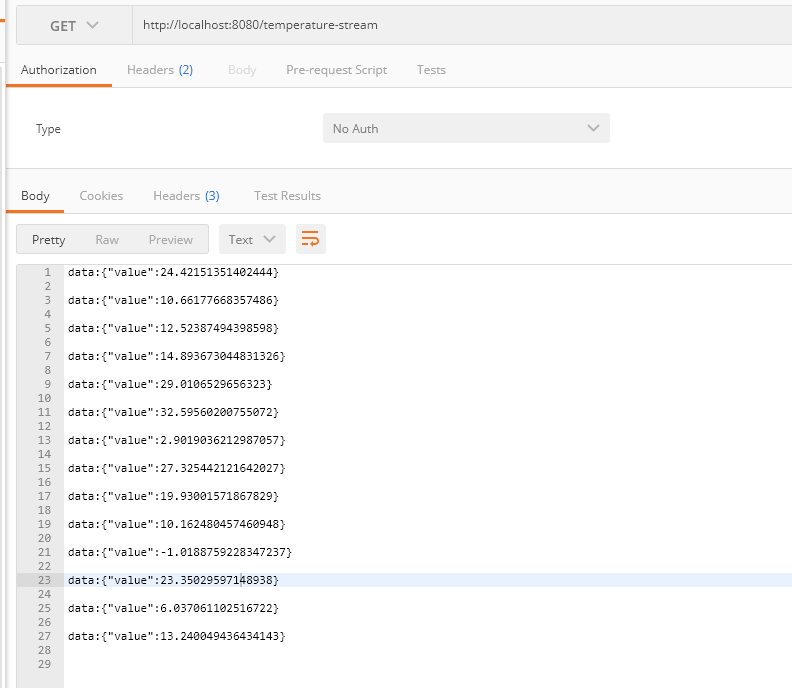

## 介绍
1. 这是SpringMVC提供的一种技术,可以实现服务端向客户端实时推送数据.用法非常简单,只需要在Controller提供一个接口,
创建并返回SseEmitter对象,发送数据可以在另一个接口调用其send方法发送数据.SpringBoot已经集成了这个 ,所以不用再引其他依赖

2. SseEmitter的send不能阻塞mvc线程，必须填返回，即放到异步里头
当然也可以调用async
方法。

3. 最终打印结果为：
但是是阻塞的？
